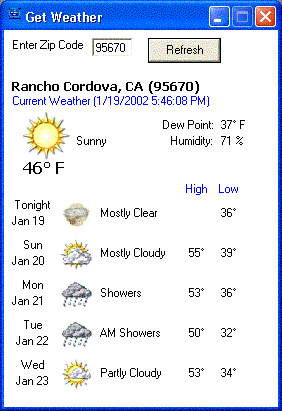



## UPDATED:  Display Weather Conditions

### Description

Displays current weather and 5 day forcast by parsing the source from the weather channel's website for a particular zip code. NOTE: Fixed it from skipping a day when it says tonight.
 
### More Info
 

             |
---                |---
**Submitted On**   |2002-01-19 16:24:34
**By**             |[Joseph Crane](https://github.com/Planet-Source-Code/PSCIndex/blob/master/ByAuthor/joseph-crane.md)
**Level**          |Intermediate
**User Rating**    |4.5 (36 globes from 8 users)
**Compatibility**  |VB 5\.0, VB 6\.0
**Category**       |[Internet/ HTML](https://github.com/Planet-Source-Code/PSCIndex/blob/master/ByCategory/internet-html__1-34.md)
**World**          |[Visual Basic](https://github.com/Planet-Source-Code/PSCIndex/blob/master/ByWorld/visual-basic.md)
**Archive File**   |[UPDATED\_\_\_499491192002\.zip](https://github.com/Planet-Source-Code/joseph-crane-updated-display-weather-conditions__1-30941/archive/master.zip)

